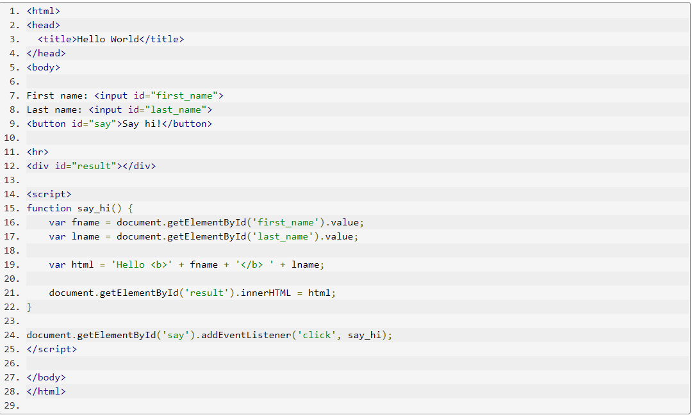

# What is JavaScript?
**JavaScript** *is a text based programming language used on both the client and server side that allows you to customize web pages*. While **HTML** and **CSS** are languages ​​that provide structure and style to web pages, JavaScript provides web pages with interactive features that engage the user. Typical examples of JavaScript that you can use daily include a search box on Amazon, a news retrieval video posted in The New York Times, or your Twitter feed updates.

## What is JavaScript used for ? &#127797;

### 1-Adding interactive behavior to web pages
JavaScript allows users to interact with web pages. There are almost no limits to the things you can do with JavaScript on a web page these are just a few examples:

- Show or hide more information with the click of a button
- Change the color of a button when the mouse hovers over it
- Slide through a carousel of images on the homepage
- Zooming in or zooming out on an image
- Displaying a timer or count-down on a website
- Playing audio and video in a web page
- Displaying animations
- Using a drop-down hamburger menu

### 2-Creating web and mobile apps

### 3-Game development

## Input and Output

